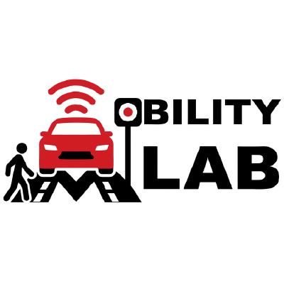
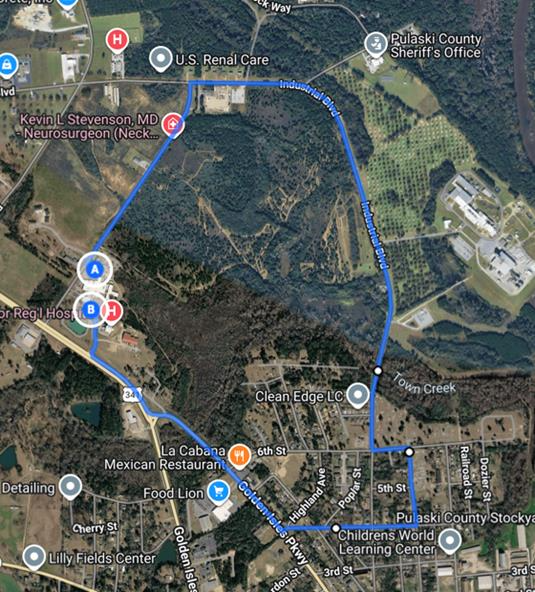

<p align="center">
  
</p>

# Rural Autonomous Vehicle (RAV) Demo — HD Map & Point-Cloud Viewer

A browser-based viewer for the UGA Mobility Lab's **rural automated-driving demonstration route**. It drapes the Lanelet2 HD map over the LiDAR point cloud it was built from, and calls out — categorised and filterable — the places along the route that are hard for an automated vehicle.

Everything parses and renders in the browser; the site only serves static files. Built to inspect the demo route and to communicate *why* rural automated driving is difficult.

**Live demo:** https://uga-mobility-lab.github.io/rav-demo/

## The route

<p align="center">
  
</p>

The demonstration route is a roughly **3-mile loop** in Hawkinsville, Pulaski County, Georgia, running past the regional hospital, along Industrial Blvd, and back via Golden Isles Parkway and US-341. It was surveyed and mapped as a representative slice of rural road, because its character changes several times around a single loop:

- long **unmarked two-way rural** stretches with no pavement markings,
- **marked rural two-way** segments with clear centre and edge lines but narrow shoulders,
- and wider **multi-lane** sections — a three-lane centre-turn road and a divided five-lane arterial —

punctuated by stop-controlled intersections, grade changes, curves, tree canopy and, in places, potential flooding. Each of these poses a different perception or planning challenge for an automated vehicle.

## Route challenges

The viewer marks each difficulty spot at the lane centre with a coloured dot, filterable by category from the sidebar. Hovering a dot shows a one-line description drawn from the route survey (markings, grade, curves, shoulder, canopy and natural risk):

- **Unmarked** — no pavement markings, so lane position must be inferred from the road edges.
- **Rural two-way road** — undivided; oncoming traffic shares a narrow corridor.
- **Wide multi-lane road** — three-lane centre-turn or divided five-lane; higher speeds and more lane changes.

## Interface

- Orbit / pan / zoom over the point cloud with the HD map draped on top
- Layer toggles: lanelet surfaces, boundaries, stop lines, traffic signs, direction arrows, route challenges
- Click any lanelet or boundary to read its full tag table, boundaries, regulatory elements, length and mean width
- Smooth **Fit / Top / 3D** camera presets, two-point measure, and per-layer opacity
- Collapsible sidebar sections; point cloud coloured by intensity, height, RGB or flat grey

## Data

The raw HD map (`.osm`) and LiDAR point cloud (`.pcd`) are **not stored on GitHub** — neither in the repository nor as release assets. They are hosted separately on a CORS-enabled host, and `config.js` points the viewer at those URLs, so the browser fetches them at runtime. `data/challenges.json` — the categorised route-challenge annotations, keyed to lanelet ids — is kept in the repo.

To run against your own data, drop an `.osm` and `.pcd` into `data/` and point `config.js` at them.

## Running locally

```bash
npm start        # dev server on http://localhost:8080 (serves src/ unbundled)
npm run build    # write dist/ — the folder deployed to GitHub Pages
npm run serve    # smoke-test dist/ on http://localhost:8080
```

No runtime dependencies: `three.js` is vendored and the dev server is a single Node file.

---

**UGA Mobility Lab.** Part of the lab's rural automated-vehicle (RAV) work — see also the [RAV literature review](https://github.com/UGA-MOBILITY-LAB/rav-literature-review).
